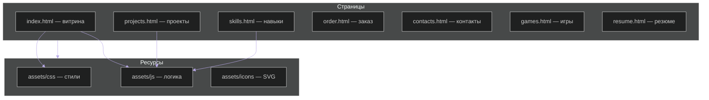

<div align="center">

# Портфолио · Глеб Чернов


<br />

[](https://samurai2306.github.io/portfolio_project)
[](https://developer.mozilla.org/docs/Web/HTML)
[](https://developer.mozilla.org/docs/Web/CSS)
[](https://developer.mozilla.org/docs/Web/JavaScript)
[](https://greensock.com/gsap/)

<br />


</div>

---

## Обзор

Статический многостраничный сайт-портфолио: **неоморфные и стеклянные панели**, переключение **тёмной / светлой темы**, **GSAP**-анимации, **Three.js** на фоне, отдельные страницы под навыки, проекты, заказ и контакты.

<details open>
<summary><strong>Быстрый старт</strong></summary>

```bash
git clone https://github.com/Samurai2306/portfolio_project.git
cd portfolio_project
```

Локально откройте `index.html` или поднимите статический сервер:

```bash
python -m http.server 8000
# или
npx serve .
```

Затем перейдите на `http://localhost:8000`.

</details>

---

## Карта сайта



---

## Блоки возможностей

<table>
<tr>
<td width="50%" valign="top">

### Интерфейс

| Элемент | Описание |
|--------|----------|
| Темы | `theme-dark` / `theme-light`, сохранение в `localStorage` |
| Навигация | Адаптивное меню, бургер, активные ссылки |
| Карточки | Glassmorphism, hover, магнитные кнопки |
| Типографика | Inter, JetBrains Mono, Space Grotesk |

</td>
<td width="50%" valign="top">

### Движение и медиа

| Элемент | Описание |
|--------|----------|
| GSAP | ScrollTrigger, таймлайны без перегруза main thread |
| Текст | Декод / комбинированные эффекты (`text-animation.js`) |
| 3D | Three.js — фоновые кубы на главной и проектах |
| Медиа | Lazy loading изображений, SVG-логотипы проектов |

</td>
</tr>
</table>

---

<details>
<summary><strong>Структура репозитория</strong></summary>

```
portfolio_project/
├── index.html
├── skills.html
├── projects.html
├── order.html
├── contacts.html
├── games.html
├── resume.html
├── assets/
│   ├── css/
│   │   ├── style.css
│   │   ├── text-animation.css
│   │   └── fonts.css
│   ├── js/
│   │   ├── main.js
│   │   ├── projects.js
│   │   ├── text-animation.js
│   │   └── games.js
│   └── icons/
└── README.md
```

</details>

<details>
<summary><strong>Где править контент</strong></summary>

- Персональные данные и тексты — в соответствующих `.html`
- Список проектов, ссылки и превью — `assets/js/projects.js`
- Цвета и темы — переменные в `assets/css/style.css` (`:root`, `.theme-light`)

</details>

---

## Палитра (ориентир)

| Роль | HEX | Примечание |
|------|-----|------------|
| Primary | `#8B5FBF` | Акценты, кнопки, градиенты |
| Secondary | `#6d28d9` | Усиление контраста |
| Accent | `#a78bfa` | Подсветка, вторичный акцент |
| Mint | `#7dd4bd` | Доп. акцент в иллюстрациях |

---

## Производительность и качество

- Lazy loading для ``
- Аккуратные GSAP-сцены, дебаунс/троттлинг где нужно
- Семантическая разметка и `aria` на интерактиве
- Цель: высокие показатели Lighthouse при типичном деплое на GitHub Pages

---

<div align="center">

### GitHub


<br />


<br /><br />

**Контакты**

[](https://t.me/mm0l0d0y)
[](mailto:undertale2006rus@gmail.com)
[](https://github.com/Samurai2306)

<br />

<sub>Сделано с вниманием к деталям, анимациям и читаемости кода.</sub>


</div>
